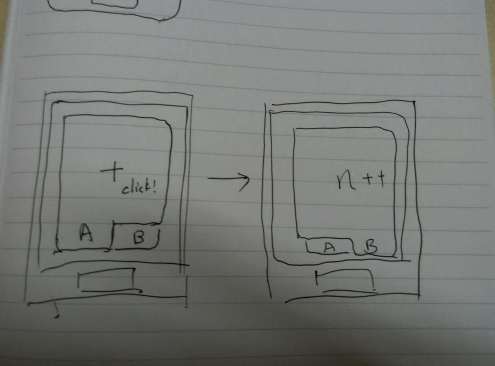

EventBus分享
===============
EventBus是什么
--------------------
EventBus是一种为Android设计的事件分发／订阅系统。


EventBus的优点
---------------------------
* 简化了组件之间的消息传递

  1.将消息发送者／接收者解耦

  2.适用于Activity、Fragment、及后台进程

  3.避免了复杂的易出错的依赖管理及生命周期问题
* 代码简洁
* 快速
* 轻量(<50k)
* 在安装量超过100,000,000的app中被验证过功能
* 具有优先级、sticky event等高级功能 

将EventBus引入项目
------------------
Gradle
```
compile 'de.greenrobot:eventbus:2.4.0'
```
如何使用EventBus的订阅／分发功能
---------------------
1.Define events:
```java
public class MessageEvent { /* Additional fields if needed */ }
```
2.Prepare subscribers:
```java
eventBus.register(this);
```
```java
public void onEvent(AnyEventType event) {/* Do something */};
```
3.Post events:
```java
eventBus.post(event);
```
Demo
--------------------------


实现功能
* 两个标签页面A&B，用Fragment实现
* 页面A点击 ```Add``` ，页面B数字递增

使用接口回调方式实现
-----------------------
在 ```FragmentA``` 中声明了自己的 ```Add``` 按钮对应的回调接口。
```java
public interface PerformAddListener {
    void performAdd();
}
```
在外层Activity中实现了该接口
```java
@Override
public void performAdd() {
    if (displayFragment == null) {
        FragmentTransaction transaction = fragmentManager.beginTransaction();
        displayFragment = new DisplayFragment();
        transaction.add(containerId, displayFragment);
        transaction.hide(displayFragment);
        transaction.commit();
        fragmentManager.executePendingTransactions();
    }
    displayFragment.add();
}
```
上述方法有如下缺点：

* Fragment之间无法直接通信，需要容器Activity充当中转器

* Activity需要实现消息发送者提供的接口，以支持回调

* Activity需要显示调用消息接受者提供的方法，以完成消息传递

* 以上各点造成了强烈的耦合，可变的东西与不可变的东西没有分离开。后续在增加／删除消息发送者／接收者时，成本成倍增加

使用EventBus实现
--------------------------
事件发送者Fragment
```java
private void postAddEvent() {
    EventBus.getDefault().post(new Event.AddEvent());
}
```
事件接收者Fragment
```java
@Override
public void onStart() {
    super.onStart();
    EventBus.getDefault().register(this);
}
```
```java
@Override
public void onStop() {
    EventBus.getDefault().unregister(this);
    super.onStop();
}
```
```java
public void onEvent(Event.AddEvent addEvent) {
    add();
}
```

从上述EventBus实现中，可以看出：

* EventBus使用的是单例模式
* 发布者需要注册，订阅者无需注册
* 通过Event类型来区分不同的事件（支持事件继承）

如果只是初步使用EventBus所提供最基础功能的话，上面所掌握的知识已经足够了，下面是一些进阶用法。

EventBus高级用法：
----------------------
在Evetn中携带信息
-----------------------
事件传递中使用的Event，本质上就是一个POJO，可以定义任意类型的字段。
```java
public class MessageEvent {
    public final String message;

    public MessageEvent(String message) {
        this.message = message;
    }
}
```
这样，在订阅者收到消息时，便能从Event中取出自己关注的信息。 
```java
public void onEvent(MessageEvent event) {
    Log.d("message=" + event.message);
}
```
ThreadMode/线程模式
--------------------
在实际开发中，往往需要根据需求的不同（是UI变化还是网络请求等），在不同的线程中进行逻辑处理。EventBus通过在接收者中使用不同的方法命名，为我们提供了简便的处理方法，无须深入到复杂的线程内部。

* **PostThread** 默认的调用方式，在同一线程中启动。如无特别需求，皆应采取此方式。
* **MainThread** 在主线程（UI线程）中启动，应避免长时间操作阻塞主线程（ANR）。
* **BackgroundThread** 使用固有的后台线程进行处理，也应当避免长时间操作造成阻塞。
* **Async** 异步处理，在主线程与后台线程之外启动新的线程，长时间操作应当用此模式。有内建线程池供复用。

在接收者中以方法名 ```onEventXXX``` 来使用不同的线程模式。

定制Custom EventBus
-------------------
通常简便的获取EventBus实例是通过 EventBus.getDefault() 来获取单例，当需要对其进行定制时，可以通过EventBusBuilder进行。
```java
EventBus eventBus = EventBus.builder().logNoSubscriberMessages(false).sendNoSubscriberEvent(false).build(); // 当没有对应接收者时不记录日志且不发送消息
```

定制Default EventBus
--------------------
如果想对默认的单例进行定制，需要在初次调用EventBus.getDefault()之前进行，通常建议放在Application类中。
```java
EventBus.builder().throwSubscriberException(BuildConfig.DEBUG).installDefaultEventBus();
```

终止Event分发
--------------------
在 ```onEvent``` 中通过 ```eventBus.cancelEventDelivery(event)``` 可以终止该Event的继续分发

Event优先级
------------------------
具有更大（自然数意义上的比较）优先级的接收者，会优先处理信息，可以搭配上一条**终止Event分发**使用。
```java
int priority = 1;
EventBus.getDefault().register(this, priority);
```

Sticky Events
----------------------
不知道怎样恰当翻译（粘性事件？）。EventBus内建了一个微型的缓存机制，可以保存最近一次以Sticky形式发送的Event，当接收者（须声明为Sticky）注册的时间晚于最近一个StickyEvent时，仍然可以接收到该Event。

发送StickyEvent
```java
EventBus.getDefault().postSticky(someEvent);
```
接收StickyEvent
```java
@Override
public void onStart() {
    super.onStart();
    EventBus.getDefault().registerSticky(this);
}

public void onEvent(SomeEvent e) {
    /* do something */
}

@Override
public void onStop() {
    EventBus.getDefault().unregister(this);
    super.onStop();
}
```
使用 ```EventBus.removeStickyEvent(Class<T> eventType)``` 方法，来移除缓存中的StickyEvent。

ProGuard配置
---------------------
因为ProGuard会对方法名进行混淆，而EB是基于反射完成的，故需要在 ```proguard.cfg``` 中配置特殊规则
```
-keepclassmembers class ** {
    public void onEvent*(**);
}
```


背景知识：观察者模式
-----------------------


**定义：**观察者模式定义了对象之间的一对多依赖，这样一来，当一个对象改变状态时，它的所有依赖者都会收到通知并自动更新。

**设计原则：**解耦合。

**主要步骤：**订阅、发放通知、取消订阅


