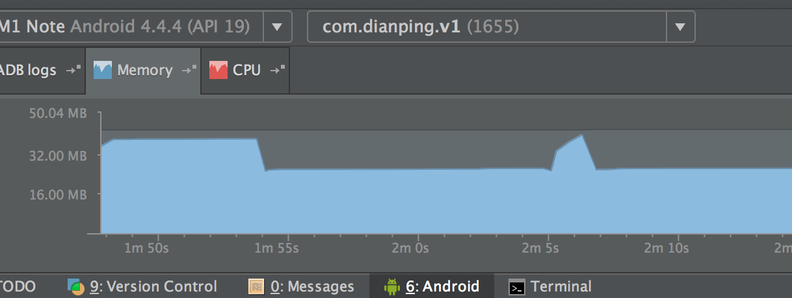
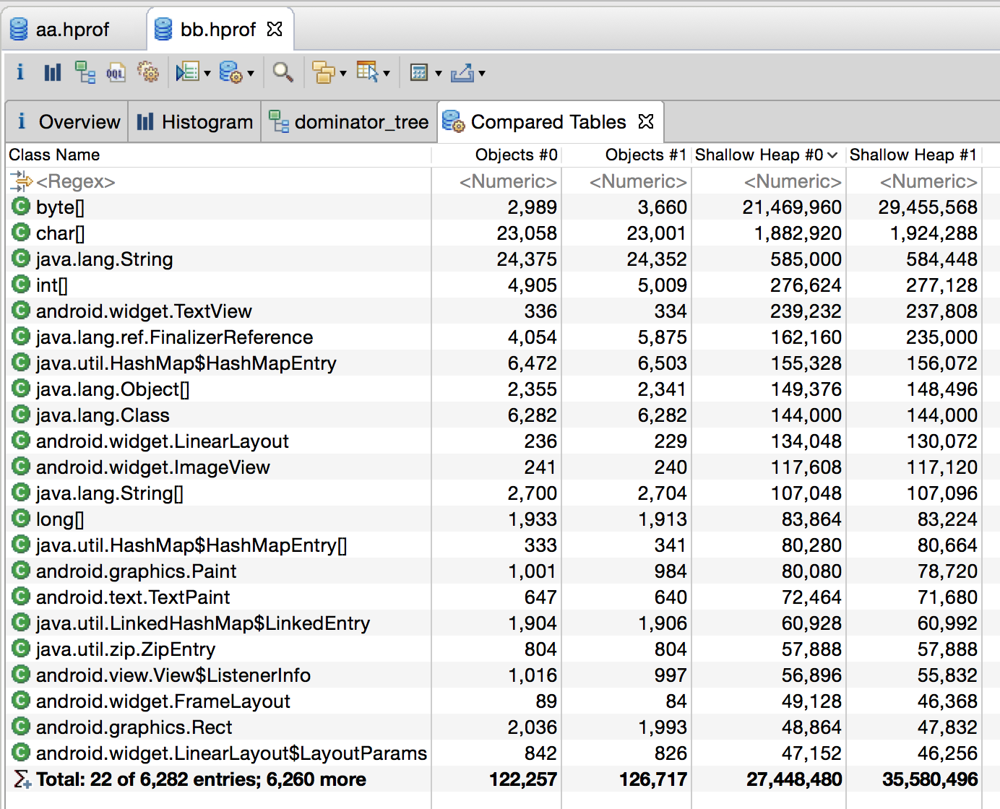
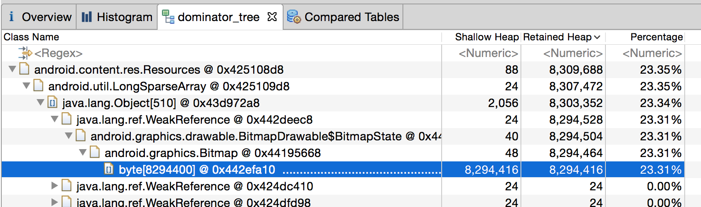
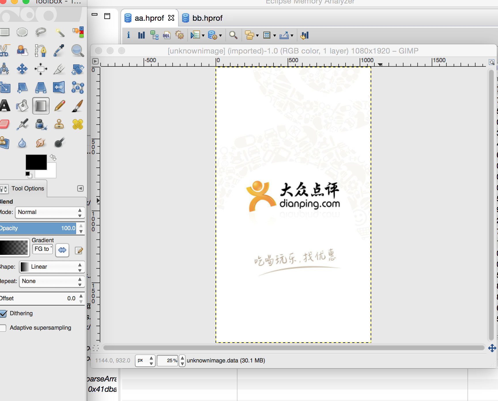
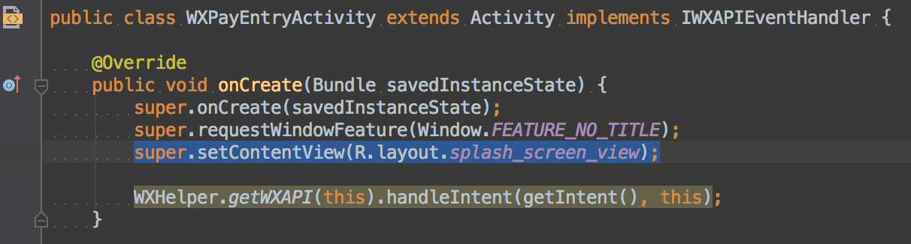
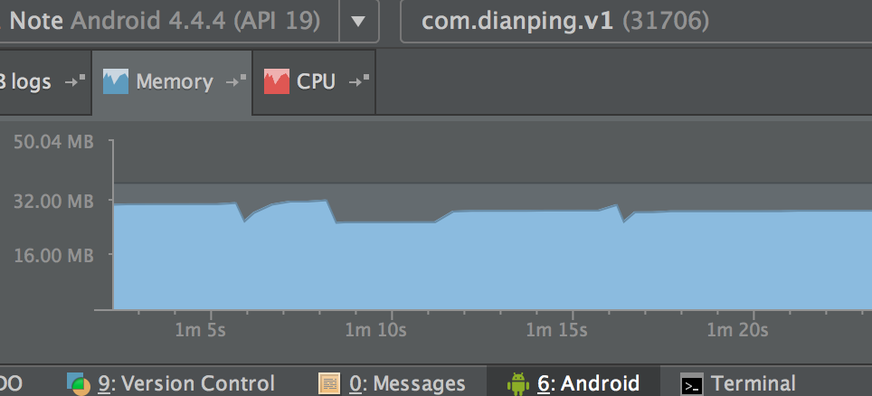

##前言
上周五的时候，祝峰找到我，反映了Android收银台买单结果页内存飙升的问题。我在自己的机器上也试着重现了一下，发现从支付台－微信支付成功并返回后，进入买单结果页的内存会突然增大，导致GC，如图（2m5s后的突然升高）：

##初步分析
问题可以重现，但原因是否在于结果页，仍有待商榷。**出于以下两个方面考虑，我判断问题出在更前面的页面：**
- 使用微信支付后，才会出现内存飙升；如果使用余额付款，一切正常；
- 结果页逻辑非常简单，并没有明显吃内存的代码。

##追踪过程
　　首先使用AndroidStudio自带的工具将内存飙升前后两个时间点的堆dump下来，分别命名为a.hprof和b.hprof，接着使用**MAT**进行对比（感谢@徐帅提供的MAT包），对比前需要使用Android SDK自带的工具**hprof-conv**（位于platform-tools下）将dump下来的两个文件进行转换，不然MAT无法识别该文件。对比截图如下：

可以见到，第一行的byte[]对比后，b.hprof比a.hprof多占用了约8mb的空间，其余对象size差异不大，断定问题就出在这个byte数组上面。接下来分析byte[]存了什么东西，会导致吃掉8mb内存。
追踪下去后发现，多出的8mb是一个bitmap！！！如下图：

将b.hprof中多出的8mb byte[]内容拷贝到文件中，重命名为unknownimage.data，使用**GIMP**打开该文件，发现罪魁祸首居然是它！

明明是app启动时的欢迎界面，怎么会出现在微信支付后的返回界面？而且实际操作过程中并没有看到它的身影。没关系，代码是不会骗人的。这个图片文件的名字是ic_splash_screen，在项目中搜索后，发现在**WXPayEntryActivity**中有如下一段代码：

到此为止真相大白！微信支付成功／失败后回调，进入WXPayEntryActivity，这里设置了页面布局为R.layout.splash_screen_view，布局文件中用match_parent设置了背景ImageView为“吃喝玩乐，找优惠”图片，在1080p的手机上，所占空间为 1920 * 1080 * 4 byte = 8294400 byte ~= 8mb。去掉这一行后，内存曲线如下（1m15s后的略微上升）：

##参考
- [使用GIMP查看图片](http://stackoverflow.com/questions/12709603/mat-eclipse-memory-analyzer-how-to-view-bitmaps-from-memory-dump)
- [内存分析工具MAT的使用](http://www.it165.net/pro/html/201402/9399.html)
