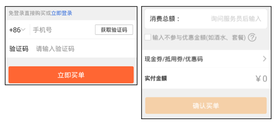
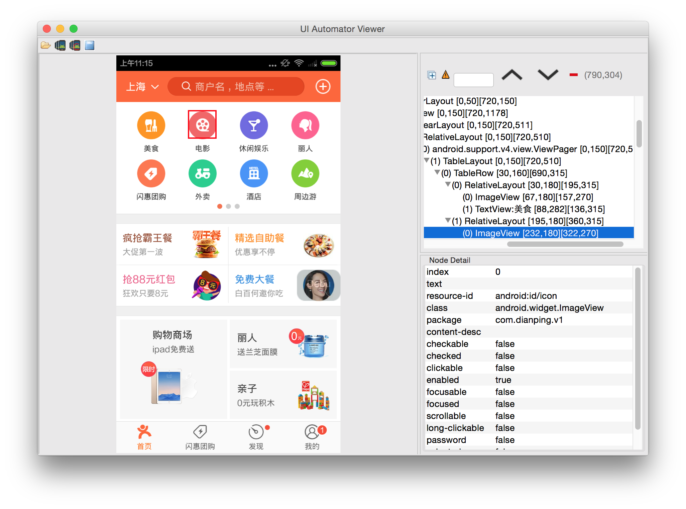

#Android Robotium自动化测试使用手册

##1.概述
Robotium是Android自带类Instrumentation的一个封装，方便测试人员直接调用封装好的接口，也就是说，实际上我们直接使用Instrumentation也能够进行自动化测试，但Robotium可以简化我们的测试步骤，我们只需要调用某个Robotium的API，传几个参数，就等于我们在调用一部分的Instrumentation帮我们实现测试。

然而实际上Robotium还是具有很多缺点的，比如所有的代码都依赖于一个Solo对象，无法很好的面向对象进行操作；H5页面操作也很繁琐，定位控件不易。故使用者可以进行一些二次开发使后续的测试工作更加简便。另外由于Robotium可以直接和源码放在同一工程下，所以其十分适合单元测试。

##2.配置方法

Robotium的配置十分方便，只需要一个Jar包即可，Jar包和文档下载：
<https://code.google.com/p/robotium/>

如果使用的IDE为Android Studio可以直接把包复制到libs文件夹下（Android Studio中需要切换为project进行显示才能看到libs文件夹）。

接着右键jar包选择Add as Library即可（相当于在gradle中添加了一行compile）

最后创建一个class（比如AppTest）继承于 ActivityInstrumentationTestCase2，并同时生成构造函数、setUp函数、tearDown函数和一些测试函数即可（测试函数使用手动生成后都是以test开头的）。

##3.初始化（有源码）
对于拥有源代码的被测程序，其初始化的形式如下：

构造函数：参数使用App的入口activity

```java
public AppTest(){
	super(SplashScreenActivity.class);
}
```

setUp函数：不要忘记新建一个Solo变量

```java
private Solo solo;

@override
public void setUp() throws Exception {
	solo = new Solo(getInstrumentation(), getActivity());
}
```

tearDown函数：

```java
@override
public void tearDown() throws Exception {
	solo.finishOpenedActivities();
}
```

##4.初始化（APK）
对于一个只有APK的应用来说，首先需要使用工具对它进行重签名，不然测试程序无法与它进行连通。重签名工具的下载地址为：

<http://recorder.robotium.com/downloads/re-sign.jar>

使用后会弹框提示应用的包名和入口Activity名，记录下来后即可进行后续的操作。

在尝试过程中发现使用Android Studio很难实现APK测试（代码一致，失败原因不明）。最后选择了Eclipse，与源码的测试主要区别是在构造函数中。

通过工具知道被测应用的完整入口activity，例如com.xxx.xxx.xxx.MainActivity。随后使用反射获取这个类，如下：

```java
private static String mainActiviy = "com.example.MainActivity";

static{
		try {
			launchActivityClass = Class.forName(mainActiviy);
		} catch (ClassNotFoundException e) {
			// TODO Auto-generated catch block
			e.printStackTrace();
		}
	}
```

而在构造函数中传入这个launchActivityClass即可。
另一方面，需要在manifest.xml中添加字段：

```java
<instrumentation
   android:name="android.test.InstrumentationTestRunner"
   android:targetPackage="com.example.xxx.xxx" />
```

这其实是Eclipse中选择Android Test Project创建项目时自动生成的，但还是需要把targetPackage修改为待测应用的包名。

##5.常用测试代码
###5.1 定位控件
Robotium的定位一般可以采用text（内容）、id、index这三种方法来定位控件。其中由于一般页面结构比较复杂，所以很难使用index进行控件定位。text定位偏向于用户侧，相对比较直观；id定位则偏向于开发侧，相对比较准确。

通过id进行操作：

```java
View view = solo.getView(id);
solo.clickOnView(view);
```
通过text进行操作（由于通过text定位必须知道控件的类型，所以可以进行以下封装，使操作统一化）：

```java
switch (viewType) {
    case Button:
        solo.clickOnButton(text);
        break;
    case Text:
        solo.clickOnText(text);
        break;
    default:
        break;
}
```

对于Editext输入框来说，找到控件同样可以通过id或者text的方法：

```java
EditText editText1 = solo.getEditText(originText);
EditText editText2 = (EditText) solo.getView(id);

solo.enterText(editText1, text);
solo.enterText(editText2, text);
```

###5.2 测试逻辑
主要用到的两个逻辑是查找search和等待waitfor：

查找逻辑的使用方法为：

```java
solo.searchText(text);
```
此方法主要在有可能产生分叉的流程中用到，例如闪惠收银台页面现在需求登录后才能付款，那么这个页面就会有登录和未登录状态，如下所以：


       
那边左侧的蓝色文字“立即登录”就可以作为区分的条件，而searchText方法返回的是boolean值，可直接用作判断条件。

waitFor则用于页面载入较慢的情况下，所以需要等待目标元素出现后再进行操作:

```java
solo.waitForText(text, 0, timeout);
dolo.waitForView(id, 0, timeout);
```

其中timeout是超时的时间限制，如果不设置默认是20秒，而第二个参数则是判断符合条件的内容出现的最少次数，0表示1个或多个。
使用waitFor的主要目的是使测试流程更加紧凑，灵活的对网络情况和机器情况进行响应，避免使用```sleep(int)```的方法使程序强制停止。

另外页面展示的结果判断目前只能通过截图来进行，截图的方法为：

```java
solo.takeScreenshot(picName);
```
其中picName是保存的图片名称，其默认存储于手机上的/sdcard/Robotium-Screenshots文件夹下。

###5.3 H5页面

这里以支付宝付款页面为例，这个页面是主流程中用到频率相对高的H5页面。
首先H5页面没有源码，无法使用Android工具进行控件查找。所以可以通过Android调试查看相应元素，当然前提是获得当前H5页面的元素集合：

```java
ArrayList<WebElement> t = solo.getCurrentWebElements();
```

有时刚跳入H5页面时，并没有获取页面焦点，所以在正式操作前，可以使用clickOnWebElement获取焦点：

```java
solo.clickOnWebElement(t.get(x));
```
而按键信息的传递，如果无法使用相关的WebElement操作方法，那么可以使用solo.sendKey方法发送KeyEvent，如下发送的是按键1，支付宝页面亲测可用：

```java
solo.sendKey(KeyEvent.KEYCODE_1);
```

而对一些正常的元素，像按钮这种一般还是可以获取到的：

```java
WebElement x = solo.getWebElement(By.tagName("BUTTON"), 0);
```

H5的大致操作方法就是这些，与Native对比，主要是在难点在于控件定位。例如支付宝密码输入的6格控件就很难使用标准操作，但通过一些其他方法还是可以达到最终的目的。

##6.控件id定位工具－uiautomatorviewer
此工具在sdk的tools目录下，其界面如下所示：



使用上方工具栏的手机按钮获取模拟器或者真机的当前屏幕截图和所有控件树形信息，右上角的空白栏目中可以看到当前屏幕中的完整控件树形结构。也可以直接从左边的界面中选定所需的控件，右上栏中就会直接定位到相应控件。而右下角则是选定控件的基本信息，包括id、内容、类型等等。


