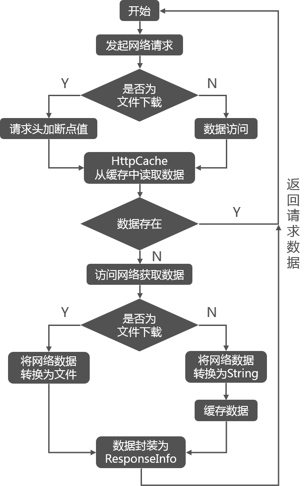

# xUtils分享
## 什么是xUtils
一个Android快速开发框架，包括四个工具模块：

* ViewUtils模块：通过注解绑定UI，资源，事件。
* HttpUtils模块：访问网络，支持同步，异步方式的请求，支持文件的上传下载。
* BitmapUtils模块：加载图片以及图片的处理，支持加载本地，网络图片，支持图片的内存和本地缓存。
* DbUtils模块：数据库orm框架， 简单的语句就能进行数据的操作。

## ViewUtils模块

### 功能

* android中的ioc框架，完全使用注解方式就可以进行UI，资源和事件绑定；
* 新的事件绑定方式，使用混淆工具混淆后仍可正常工作；
* 目前支持常用的20种事件绑定，参见ViewCommonEventListener类和包com.lidroid.xutils.view.annotation.event。

### 知识回顾：Java注解

> 注解指能够添加到Java源代码的语法元数据。类、方法、变量、参数、包都可以被注解，可用来将信息元数据与程序元素进行关联。
>
> * 标记，用于告诉编译器一些信息
> * 编译时动态处理，如动态生成代码
> * 运行时动态处理，如得到注解信息

关于注解的具体分类和详细用法：
[公共技术点-Java注解](http://www.codekk.com/open-source-project-analysis/detail/Android/Trinea/%E5%85%AC%E5%85%B1%E6%8A%80%E6%9C%AF%E7%82%B9%E4%B9%8B%20Java%20%E6%B3%A8%E8%A7%A3%20Annotation)

### UI绑定

传统方式：
```java
Button btn;  
ImageView img;
ListView list;

@Override  
protected void onCreate(Bundle savedInstanceState) {  
    super.onCreate(savedInstanceState);  
    setContentView(R.layout.activity_main);  

    btn = (Button) findViewById(R.id.btn);  
    img = (ImageView) findViewById(R.id.img);  
    list = (ListView) findViewById(R.id.list);  
}
```
注解方式：
```java
@ViewInject(R.id.btn)  
Button btn;

@ViewInject(R.id.img)  
ImageView img;  

@ViewInject(R.id.list)  
ListView list;  

@Override  
protected void onCreate(Bundle savedInstanceState) {  
    super.onCreate(savedInstanceState);  
    setContentView(R.layout.activity_main);  
    ViewUtils.inject(this);
}
```
**注意：在使用注解绑定控件的时候，一定要记得在onCreate中调用ViewUtils.inject(this);**

### 事件绑定

传统方式：
```java
btn.setOnClickListener(this);
img.setOnClickListener(this);
list.setOnItemClickListener(new OnItemClickListener() {  
    @Override  
    public void onItemClick(AdapterView<?> parent, View view, int position, long id) {  
        // list点击操作
    }  
});

@Override  
public void onClick(View v) {
    // btn，img点击操作
}
```
注解方式：
```java
@OnClick({ R.id.btn, R.id.img })  
public void clickMethod(View v) {
    // btn，img点击操作
}  

@OnItemClick(R.id.list)  
public void itemClick(AdapterView<?> parent, View view, int position,long id) {  
    // list点击操作
}
```
### 源码解析
1.ViewUtils.java

View和各种事件的注入以及资源的注入。
```java
private static void injectObject(Object handler, ViewFinder finder)
```
第一个参数Object handler代表的是需要注入的对象， 第二个参数是需要注入View（这个View就是 handler 的成员变量）所在的 View或者Activity的包装对象。该方法完成了View和各种事件的注入以及资源的注入。主要的原理就是通过反射和注解：

* 完成Activity的setContentView。
* 完成View 的注入。
* 完成资源的注入。
* 完成各种事件的注入。

2.ViewFinder.java
```java
public View findViewById(int id, int pid)
public View findViewById(int id)
```
如果存在父View， 优先从父View寻找，否则从当前的View或者Activity中寻找。

3.ResLoader.java
```java
public static Object loadRes(ResType type, Context context, int id)
```
获取资源文件值，支持多种资源的获取。

4.EventListenerManager.java

事件的注入，基于动态代理。
```java
private final static DoubleKeyValueMap<ViewInjectInfo, Class<?>, Object> listenerCache =
new DoubleKeyValueMap<ViewInjectInfo, Class<?>, Object>();
```
存放监听事件接口map。因为有些接口有多个函数，代理会判断事件接口是否存在，如果存在只增加代理方法就够了， 避免重新设置监听事件接口。
```java
public static void addEventMethod( ViewFinder finder, ViewInjectInfo info,
            Annotation eventAnnotation, Object handler, Method method)
```
代理监听事件

## HttpUtils模块
### 功能
* 支持同步，异步方式的请求；
* 支持大文件上传，上传大文件不会oom；
* 支持GET，POST，PUT，MOVE，COPY，DELETE，HEAD，OPTIONS，TRACE，CONNECT请求；
* 下载支持301/302重定向，支持设置是否根据Content-Disposition重命名下载的文件；
* 返回文本内容的请求(默认只启用了GET请求)支持缓存，可设置默认过期时间和针对当前请求的过期时间。

### 流程图


### Http请求
异步Get请求：
```java
HttpUtils httpUtils = new HttpUtils(5000,"Mozilla/5.0...");
//第一个参数，连接超时时间 ，第二个参数userAgent客户端标识

httpUtils.send(HttpRequest.HttpMethod.GET, "http://www.qq.com", new RequestCallBack<String>() {
    @Override  
    public void onStart() {
        // 请求开始后的操作
    }  

    @Override  
    public void onLoading(long total, long current, boolean isUploading) {
        // 请求进行时的操作
    }  

    @Override
    public void onSuccess(ResponseInfo<String> responseInfo) {
        // 请求成功后的操作
    }

    @Override
    public void onFailure(HttpException error, String msg) {
        // 请求失败后的操作
    }
});
```
同步Get请求：
```java
try {     
    ResponseStream responseStream = httpUtils.sendSync(HttpRequest.HttpMethod.GET, "http://www.qq.com");
    int statusCode = responseStream.getStatusCode();
    if(statusCode==200){
        //进行对应操作
    }
    responseStream.close();
} catch (HttpException e) {
    e.printStackTrace();
} catch (IOException e) {
    e.printStackTrace();
}
```
Post请求：
```java
RequestParams params = new RequestParams();  
params.addQueryStringParameter("action", "login");
params.addBodyParameter("username", "admin");
params.addBodyParameter("password", "e10adc3949ba59abbe56e057f20f883e");  

HttpUtils http = new HttpUtils();  
http.send(HttpRequest.HttpMethod.POST, "https://www.qq.com", params,  
    new RequestCallBack<String>() {  
        @Override  
        public void onStart() {
            // 请求开始后的操作
        }  

        @Override  
        public void onLoading(long total, long current, boolean isUploading) {
            // 请求进行时的操作
        }  

        @Override  
        public void onSuccess(ResponseInfo<String> responseInfo) {
            // 请求成功后的操作
        }  

        @Override  
        public void onFailure(HttpException error, String msg) {
            // 请求失败后的操作
        }  
    });  
```
### 下载文件
```java
HttpUtils http = new HttpUtils();
HttpHandler handler = http.download("http://192.168.5.161:8081/gradle/gradle-2.4-all.zip",
    "/sdcard/gradle-2.4-all.zip",
    true, // 如果目标文件存在，接着未完成的部分继续下载。服务器不支持RANGE时将从新下载。
    true, // 如果从请求返回信息中获取到文件名，下载完成后自动重命名。
    new RequestCallBack<File>() {
        @Override
        public void onStart() {
            // 下载文件开始后的操作
        }

        @Override
        public void onLoading(long total, long current, boolean isUploading) {
            // 下载文件进行时的操作
        }

        @Override
        public void onSuccess(ResponseInfo<File> responseInfo) {
            // 下载文件成功后的操作
        }


        @Override
        public void onFailure(HttpException error, String msg) {
            // 下载文件失败后的操作
        }
});
...
//停止下载，如果设置断点下载的话，下次会重新开始的话，会自动从上次下载的断点处继续下载
handler.cancel();
...
```
### 上传文件
```java
HttpUtils httpUtils = new HttpUtils(5000);
// 指定字符编码
RequestParams params = new RequestParams("UTF-8");
params.addQueryStringParameter("file","123");
params.addBodyParameter("username","admin");
params.addBodyParameter("password", "e10adc3949ba59abbe56e057f20f883e");
// 如需附加http头字段
params.addHeader("User-Agent","Mozilla/5.0...");
httpUtils.send(HttpRequest.HttpMethod.POST, "http://www.qq.com/upload", params,
    new RequestCallBack<String>() {
        @Override
        public void onStart() {
            // 上传文件开始后的操作
        }

        @Override
        public void onLoading(long total, long current, boolean isUploading) {
            // 上传文件进行时的操作
        }

        @Override
        public void onSuccess(ResponseInfo<File> responseInfo) {
            // 上传文件成功后的操作
        }

        @Override
        public void onFailure(HttpException error, String msg) {
            // 上传文件失败后的操作
        }
    });
```
### 源码分析
1.HttpUtils.java

支持异步同步访问网络数据， 断点下载文件。
```java
//网络数据的缓存。
public final static HttpCache sHttpCache = new HttpCache();
//访问网络的 HttpClient。
private final DefaultHttpClient httpClient;
private final HttpContext httpContext = new BasicHttpContext();
//线程池。
private final static PriorityExecutor EXECUTOR = new PriorityExecutor(DEFAULT_POOL_SIZE);
...
public HttpUtils(int connTimeout, String userAgent) {
    //配置超时时间，UserAgent， http 版本信息协议等一些信息
    .....
    //将配置的参数统一放到 httpClient 中
    httpClient = new DefaultHttpClient(new ThreadSafeClientConnManager(params, schemeRegistry), params);
    ....

    //下面这个关键，设置拦截器。 默认加上 gizp 压缩。 通过 gizp 压缩后的数据传输效率高很多。
    httpClient.addRequestInterceptor(new HttpRequestInterceptor() {
        @Override
        public void process(org.apache.http.HttpRequest httpRequest, HttpContext httpContext) throws org.apache.http.HttpException, IOException {
            if (!httpRequest.containsHeader(HEADER_ACCEPT_ENCODING)) {
                httpRequest.addHeader(HEADER_ACCEPT_ENCODING, ENCODING_GZIP);
            }
        }
    });

    httpClient.addResponseInterceptor(new HttpResponseInterceptor() {
        @Override
        public void process(HttpResponse response, HttpContext httpContext) throws org.apache.http.HttpException, IOException {
            final HttpEntity entity = response.getEntity();
            if (entity == null) {
                return;
            }
            final Header encoding = entity.getContentEncoding();
            if (encoding != null) {
                for (HeaderElement element : encoding.getElements()) {
                    if (element.getName().equalsIgnoreCase("gzip")) {
                        //这里判断从服务器传输的数据是否需要通过 gzip 解压。
                        response.setEntity(new GZipDecompressingEntity(response.getEntity()));
                        return;
                    }
                }
            }
        }
    });
}
...
//访问网络数据
private <T> HttpHandler<T> sendRequest(HttpRequest request, RequestParams params, RequestCallBack<T> callBack);
//下载网络文件
public HttpHandler<File> download(HttpRequest.HttpMethod method, String url, String target,
    RequestParams params, boolean autoResume, boolean autoRename, RequestCallBack<File> callback);
```
2.HttpRequest.java

网络请求的包装类，包括url，访问请求方法，参数值等。

3.RequestCallBack.java

完成数据请求回调接口。

4.HttpHandler.java

获取网络数据逻辑的实现。

5.HttpCache.java

网络数据的缓存，内部包含LruMemoryCache，在获取数据的时候会判断是否过期。

6.StringDownLoadHandler.java

handleEntity()将网络io流转化为String。

7.FileDownLoadHandler.java

handleEntity()将网络io流转化为File。

8.HttpException.java

统一异常对象。

### 对比Volley
相同点：
* 均采用了网络数据缓存机制。
* 均通过handler进行线程通信

不同点：
* Http请求

> Volley的Http请求在android 2.3版本之前是通过HttpClient，在之后的版本是通过URLHttpConnection。

URLHttpConnection默认支持GZIP压缩，api操作简单。

> xUtils都是通过HttpClient请求网络（bitmap模块图片下载是通过URLHttpConnection）。

xUtils可以设置拦截器，对请求做了GZIP压缩

* 数据缓存结构

> Volley将Http请求数据先缓存进byte[]，然后是分配给不同的请求转化为需要的格式。

特点：扩展性好，但是不能存在大数据请求，否则就OOM。

> xUtils是直接转化为想要的格式。

特点：不缓存入byte[]支持大数据的请求，速度比Volley稍快，但扩展性低。

* 多线程实现

> Volley访问网络数据时直接开启固定个数的线程访问网络，在run方法中执行死循环，阻塞等待请求队列。

> xUtils是开启线程池来管理线程。

* 缓存失效策略

> Volley的所有网络数据支持从http响应头中控制是否缓存和读取缓存失效时间，每个请求可以控制是否缓存和缓存失效时间。

> xUtils网络数据请求是统一自定义缓存失效时间。

* 文件传输支持

> Volley不支持文件上传/下载。

> xUtils支持文件上传/下载，支持进度显示，支持断点。

## BitmapUtils模块

### 功能

* 加载bitmap的时候无需考虑bitmap加载过程中出现的oom和android容器快速滑动时候出现的图片错位等现象；
* 支持加载网络图片和本地图片；
* 内存管理使用LRU算法，更好的管理bitmap内存；
* 可配置线程加载线程数量，缓存大小，缓存路径，加载显示动画等...。

### 流程图


### listview优化
```java
// 使用ListView等容器展示图片时可通过PauseOnScrollListener控制滑动和快速滑动过程中时候暂停加载图片
listView.setOnScrollListener(new PauseOnScrollListener(bitmapUtils, false, true));
listView.setOnScrollListener(new PauseOnScrollListener(bitmapUtils, false, true, customListener));
```

### 加载图片
```java
BitmapUtils bitmapUtils = new BitmapUtils(this);
// 加载本地图片(路径以/开头， 绝对路径)
bitmapUtils.display(testImageView, "/sdcard/test.jpg");
// 加载assets中的图片(路径以assets开头)
bitmapUtils.display(testImageView, "assets/img/test.jpg");
// 加载网络图片 第一个参数：如果是ImageView控件，则显示图片，否则显示为背景，第二个参数图片网络地址
bitmapUtils.display(testImageView,  "http://mat1.gtimg.com/www/images/qq2012/qqlogo_1x.png");
```
当加载网路图片时，还可以传第三个参数，一个BitmapDisplayConfig对象，用于设置图片的配置：
```java
BitmapDisplayConfig displayConfig = new BitmapDisplayConfig();
//设置加载中的图片
Resources resources = getResources();
displayConfig.setLoadingDrawable(resources.getDrawable(R.drawable.ic_launcher));
//设置加载失败的图片
displayConfig.setLoadFailedDrawable(resources.getDrawable(android.R.drawable.ic_delete));
//设置Bitmap像素的配置
displayConfig.setBitmapConfig(Bitmap.Config.ARGB_8888);
//设置内存中Bitmap最大的像素尺寸,减少内存占用
BitmapSize size = new BitmapSize(100,50);
displayConfig.setBitmapMaxSize(size);
//设置图片加载成功之后 到最终图片显示完成之间的动画效果
displayConfig.setAnimation(animation);

bitmapUtils.display(imageView, url, displayConfig);
```
为了简化多次设置，还可以给BitmapUtils设置全局的默认配置：
```java
BitmapUtils bitmapUtils = new BitmapUtils(this);
//设置默认的加载中的图片
bitmapUtils.configDefaultLoadingImage(R.drawable.ic_launcher);
//设置默认的加载失败的图片
bitmapUtils.configDefaultLoadFailedImage(android.R.drawable.ic_delete);
//设置默认的图片尺寸
bitmapUtils.configDefaultBitmapMaxSize(new BitmapSize(100,50));
//设置默认的加载超时时间
bitmapUtils.configDefaultConnectTimeout(2000);
//加载第一张图片
bitmapUtils.display(imageView1, url_1);
//加载第二张图片
bitmapUtils.display(imageView2, url_2);
//加载第三张图片
bitmapUtils.display(imageView3, url_3);
```
### 知识回顾：LRU算法
Least Recently Used，近期最少使用算法, xUtils中LruDiskCache类，用基于链表结构的LinkedHashMap作为存储结构。

情景：内存缓存设置的阈值只够存储n个bitmap对象，LRU算法按照使用频率的顺序排列所存储的bitmap对象，当put第n+1个bitmap对象时，将近期最少使用的bitmap对象移除。

关于图片缓存及LRU算法的知识拓展戳[这里](http://blog.csdn.net/t12x3456/article/details/7788149)
### 源码分析
1.BitmapUtils.java

图片的异步加载，支持本地和网络图片， 图片的压缩处理， 图片的内存缓存以及本地缓存。
```java
private BitmapGlobalConfig globalConfig; // 线程池，缓存，和网络的配置
private BitmapDisplayConfig defaultDisplayConfig; //图片显示的配置
/**
* @param container 表示需要显示图片的 View
* @param uri 图片的 uri
* @param displayConfig 图片显示的配置
* @param callBack 图片加载的回调接口
*/
public <T extends View> void display(T container, String uri, BitmapDisplayConfig displayConfig, BitmapLoadCallBack<T> callBack)
```
加载图片的异步任务，会在doInBackground方法中读取图片资源。

2.BitmapCache.java
```java
private LruDiskCache mDiskLruCache; //闪存缓存
private LruMemoryCache<MemoryCacheKey, Bitmap> mMemoryCache; //运存缓存
...
//下载网络图片， 然后根据配置压缩图片， 将图片缓存。
public Bitmap downloadBitmap(String uri, BitmapDisplayConfig config, final BitmapUtils.BitmapLoadTask<?> task)
//从运存缓存中读取 bitmap 在获取的时候会判断是否过期
public Bitmap getBitmapFromMemCache(String uri, BitmapDisplayConfig config)
//从闪存缓存中读取 bitmap
public Bitmap getBitmapFromDiskCache(String uri, BitmapDisplayConfig config)
```
3.BitmapGlobalConfig.java

配置， 包括线程池， 缓存的大小。
```java
//闪存缓存的路径
private String diskCachePath;
//运存缓存的最大值
private int memoryCacheSize = 1024 * 1024 * 4; // 4MB
//闪存缓存的最大值
private int diskCacheSize = 1024 * 1024 * 50;  // 50M
//从网络加载数据的线程池
private final static PriorityExecutor BITMAP_LOAD_EXECUTOR = new PriorityExecutor(DEFAULT_POOL_SIZE);
//从闪存读取数据的线程池
private final static PriorityExecutor DISK_CACHE_EXECUTOR = new PriorityExecutor(2);
//bitmap 缓存的的时间
private long defaultCacheExpiry = 1000L * 60 * 60 * 24 * 30; // 30 days
//bitmap 缓存
private BitmapCache bitmapCache;
```
4.BitmapDisplayConfig.java
```java
//图片显示的大小
private BitmapSize bitmapMaxSize;
//图片的动画
private Animation animation;
// 图片加载过程中的显示图片
private Drawable loadingDrawable;
// 图片加载失败的显示图片
private Drawable loadFailedDrawable;
// 图片显示的配置色彩
private Bitmap.Config bitmapConfig = Bitmap.Config.RGB_565;
```
5.DefaultDownloader.java

获取bitmap，支持三种获取路径，本地图片，资源图片和网络图片。

6.DefaultBitmapLoadCallBack.java

图片加载完成的的回调， 默认回调将获取的bitmap值传递给view。

## DbUtils模块

### 功能

* android中的orm框架，一行代码就可以进行增删改查；
* 支持事务，默认关闭；
* 可通过注解自定义表名，列名，外键，唯一性约束，NOT NULL约束，CHECK约束等（需要混淆的时候请注解表名和列名）；
* 支持绑定外键，保存实体时外键关联实体自动保存或更新；
* 自动加载外键关联实体，支持延时加载；
* 支持链式表达查询，更直观的查询语义，参考下面的介绍或sample中的例子。

### 创建
通常，Android如果要存储一个对象，需要创建一个SQLiteOpenHelper，然后创建一张对应对象各个属性的表，还得把对象转换成ContentValues，进而去存储。

而DbUtils在进行save操作的时候，会根据java反射反射出对象的各个字段，然后去查询数据库中是否存在这个对象类型对应的表，如果表已经存在，直接进行插入操作；如果不存在，就先动态的创建的一张对应我们对象的表，再进行插入处理。
```java
@Table(name = "account")
public class User {
    @ID
    private long id;
    @Column
    private int name;
    @Column
    private int password;
    //... 其他字段

    public long getId() {
        return id;
    }

    public void setId(long id) {
        this.id = id;
    }

    //... 其他字段的setter and getter
}
```
然后就可以添加对象到数据库：
```java
DbUtils db = DbUtils.create(this);
User user = new User(); //这里需要注意的是User对象必须有id属性，或者有通过@ID注解的属性
user.setName("admin");
user.setPassword("e10adc3949ba59abbe56e057f20f883e");
db.save(user); // 使用saveBindingId保存实体时会为实体的id赋值
```
**注意：并不是所有的实体对象都快可以通过这种方式去存储，一定要保证对象的类型中有int类型的id或者_id的属性，这就对应数据库表中的主键字段。**

> 如果类型中没有id字段，可以通过@Id注解去指定一个int类型的字段作为主键。

> 如果表中有字段不想被存储在数据库中，也可以通过@Transient去实现忽略。

> 如果直接存储一个对象的列表，这样也是被允许的，达到批量存储的目的。

### 查询
```java
// 查找
User entity = db.findById(User.class, user.getId());
List<User> list = db.findAll(User.class);//通过类型查找
User user = db.findFirst(Selector.from(User.class).where("name","=","test"));

// IS NULL
User user = db.findFirst(Selector.from(User.class).where("name","=", null));
// IS NOT NULL
User user = db.findFirst(Selector.from(User.class).where("name","!=", null));

// WHERE id<54 AND (age>20 OR age<30) ORDER BY id LIMIT pageSize OFFSET pageOffset
List<User> list = db.findAll(Selector.from(User.class)
    .where("id" ,"<", 54)
    .and(WhereBuilder.b("age", ">", 20).or("age", " < ", 30))
    .orderBy("id")
    .limit(pageSize)
    .offset(pageSize * pageIndex));

// op为"in"时，最后一个参数必须是数组或Iterable的实现类(例如List等)
User test = db.findFirst(Selector.from(User.class).where("id", "in", new int[]{1, 2, 3}));
// op为"between"时，最后一个参数必须是数组或Iterable的实现类(例如List等)
User test = db.findFirst(Selector.from(User.class).where("id", "between", new String[]{"1", "5"}));

DbModel dbModel = db.findDbModelAll(Selector.from(User.class).select("name"));//select("name")只取出name列
List<DbModel> dbModels = db.findDbModelAll(Selector.from(User.class).groupBy("name").select("name", "count(name)"));

List<DbModel> dbModels = db.findDbModelAll(sql); // 自定义sql查询
db.execNonQuery(sql) // 执行自定义sql
```

### 更新
```java
List<User> users = dbUtils.findAll(Selector.from(User.class));  
User user = user.get(0);  
user.setAge(20);  
dbUtils.update(user);  
```

### 删除
```java
List<User> users = dbUtils.findAll(Selector.from(User.class));  
dbUtils.delete(users.get(0));  
dbUtils.deleteAll(users);  
dbUtils.deleteById(User.class, WhereBuilder.b("age", "==", 20));  
dbUtils.dropTable(User.class);  
dbUtils.dropDb();  
```
