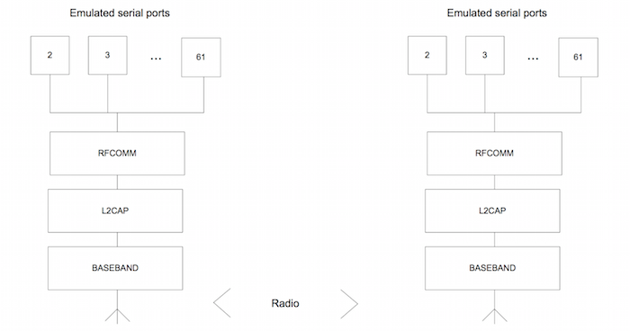
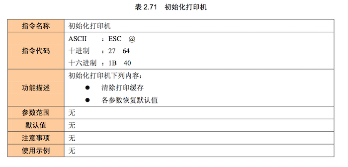
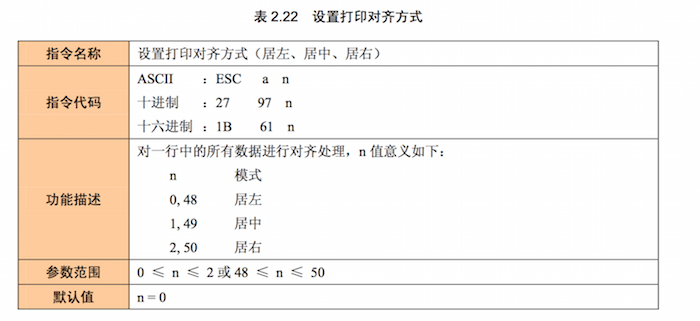
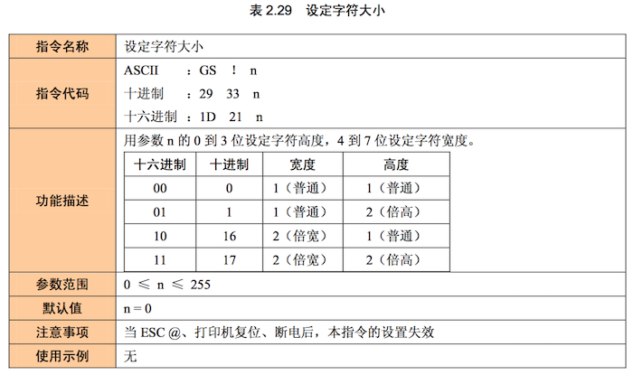
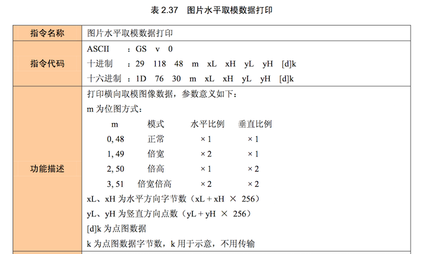

最近在公司App实现了蓝牙打印功能，主要是通过App搜索到蓝牙打印机，连接，打印文本和图片。简单总结一下整个流程使用的东东。

 
## 蓝牙RFCOMM协议
RFCOMM是一个简单传输协议，其目的为了解决如何在两个不同设备上的应用程序之间保证一条完整的通信路径，并在它们之间保持一通信段的问题。

## 打印机ESC/POS指令
日本的 EPSON 公司在目前的 POS 打印机市场，尤其是针式打印机市场占有很大一部分份额。它所推行的 ESC 打印控制命令 (EPSON StandardCode for Pr5nter) 已经成为了针式打印机控制语言事实上的工业标准，ESC/POS 打印命令集是 ESC 打印控制命令的简化版本，现在大多数 POS 打印都采用 ESC/POS 指令集。绝大多数打印机都有 EPSON ESC 的软件命令仿真功能，而且其它打印控制命令的格式和功能也都与 ESC 代码集类似。

1. 初始化  
	
	
2. 打印文字
	
	
3. 打印图片
	

## Android API

1. BluetoothAdapter 
本地蓝牙设备适配器，获取本地蓝牙信息，搜索附近蓝牙设备。
`BluetoothAdapter adapter = BluetoothAdapter.getDefaultAdapter()`
`adapter.startDiscovery()`
`Set<BluetoothDevice> devices = adapter.getBondedDevices()`

2. BluetoothDevice

 远程蓝牙设备，可以获取mac,name,连接状态等。用于连接socket。
`BluetoothSocket mClientSocket=mDevice.createRfcommSocketToServiceRecord(UUID.fromString(RF_UUID))`

3. BluetoothSocket 
 蓝牙连接socket，RFCOMM通信基础，通过获取output和input和蓝牙设备通信。

	`mClientSocket.connect()`
	`OutputStream mOutPut = mClientSocket.getOutputStream()`
	`mOutPut.write(bytes)`

	
## 实例
1. 初始化
	
	`mOutPut.write(new byte[] { 0x1B, 0x40 })`

2. 设置文字居中显示

   `mOutPut.write(new byte[] { 0x1B, 0x61, 0x01 })`

3. 打印文字
   
   `mOutPut.write("测试文字".getBytes("GB2312"))`

4. 打印图片(16*16,正常尺寸)

	`mOutPut.write(new byte[] { 0x1D, 0x76, 0x30, 0x00, 0x10, 0x00, 0x01,0xFF..... })`

5. 释放打印资源

  ` mClientSocket.close()`

   
   

## 参考

[1] [RFCOMM](http://baike.baidu.com/subview/493704/493704.htm)

[2] [Java无驱打印](https://www.ibm.com/developerworks/cn/java/j-lo-pos/)

[3]  [ZLG-ESCPOS 打印协议](http://www.zlgmcu.com/ZLG/Print/pdf/ZLG-ESCPOS.pdf)
